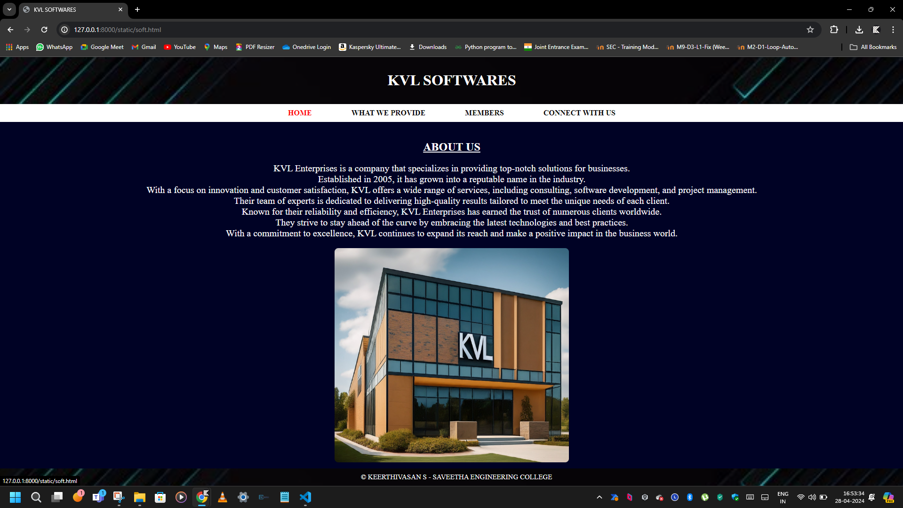
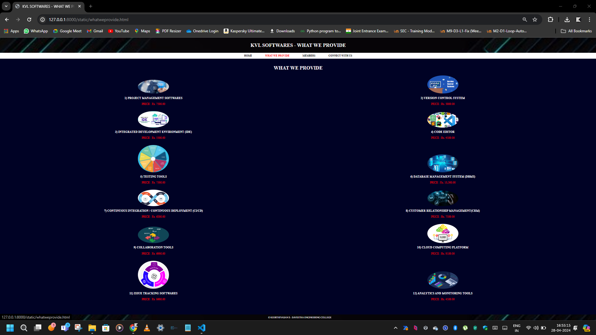
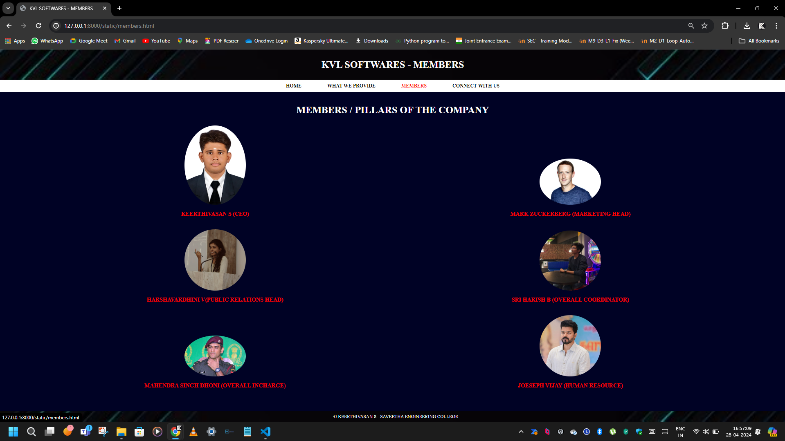
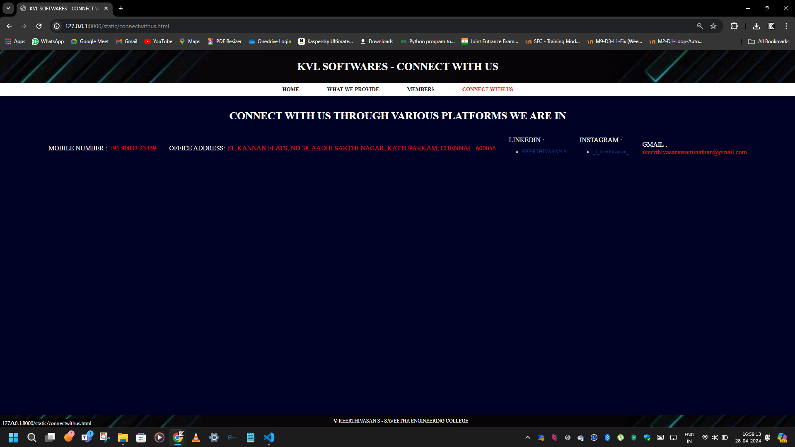

# Ex.07 Software Product Company Website

## Date : 28/04/2024

## AIM:
To develop a static company website to display the softwares and services provided by the company.

## DESIGN STEPS:

### Step 1:
Requirement collection.

### Step 2:
Creating the layout using HTML and CSS.

### Step 3:
Updating the sample content.

### Step 4:
Choose the appropriate style and color scheme.

### Step 5:
Validate the layout in various browsers.

### Step 6:
Validate the HTML code.

### Step 7:
Publish the website in the given URL.

## PROGRAM:

soft.html

```
<html>
<head>
<title>KVL SOFTWARES</title>
    <style>
        body {
            font-family: 'Times New Roman', Times, serif, sans-serif;
            margin: 0;
            padding: 0;
            background-color: #000225;
            color: #fff;
        }
        header {
            background-image: url('bgimage(header,footer).jpg');
            background-size: cover;
            background-position: center;
            background-color: #000000;
            color: #fdfdfd;
            padding: 10px;
            text-align: center;
        }
        nav {
            background-color: #ffffff;
            padding: 10px;
            text-align: center;
        }
        nav a {
            margin: 0 40px;
            text-decoration: none;
            color: #000000;
            transition: color 0.3s;
        }
        nav a:hover {
            color: #ff0000;
        }
        footer {
            background-image: url('bgimage(header,footer).jpg');
            background-size: cover;
            background-position: center;
            background-color: #000000;
            background-color: #000000;
            color: #ffffff;
            text-align: center;
            padding: 10px;
            position: fixed;
            bottom: 0;
            width: 100%;
        }

        .content {
            padding: 20px;
            text-align: center;
        }
        h2 {
            color: #fff;
            text-decoration: underline;
            transition: color 0.3s;
        }
        h2:hover {
            color: #ff0000;
        }
        p {
            color: #ffffff;
            margin-bottom: 20px; 
            font-size: 20px;
          }
        .image-container {
            display: flex;
            justify-content: space-around;
            margin-bottom: 20px; 
                         }
        .image-container img {
            max-width: 26.5%; 
            border-radius: 8px; 
        }
        p1 {
            color: #fff  ;
            margin-bottom: 20px; 
            font-size: 15px;
          }
    </style>
</head>
<body>
    <header>
        <h1>KVL SOFTWARES</h1>
    </header>
    <nav>
        <a href="soft.html"><strong>HOME</strong></a>
        <a href="whatweprovide.html"><strong>WHAT WE PROVIDE</strong></a>
        <a href="members.html"><strong>MEMBERS</strong></a>
        <a href="connectwithus.html"><strong>CONNECT WITH US</strong></a>
    </nav>
    <div class="content">
        <h2>ABOUT US</h2>
        <p>
            KVL Enterprises is a company that specializes in providing top-notch solutions for businesses.<br>
            Established in 2005, it has grown into a reputable name in the industry.<br>
            With a focus on innovation and customer satisfaction, KVL offers a wide range of services, including consulting, software development, and project management.<br>
            Their team of experts is dedicated to delivering high-quality results tailored to meet the unique needs of each client. <br>
            Known for their reliability and efficiency, KVL Enterprises has earned the trust of numerous clients worldwide.<br>
            They strive to stay ahead of the curve by embracing the latest technologies and best practices.<br>
            With a commitment to excellence, KVL continues to expand its reach and make a positive impact in the business world.<br>
        </p>
        <div class="image-container">
            
        </div>
    </div>
    <footer>
        <p1>&#169 KEERTHIVASAN S - SAVEETHA ENGINEERING COLLEGE</p1>
    </footer>
</body>
</html>
```

whatweprovide.html

```
<html>
<head>
    <title>KVL SOFTWARES - WHAT WE PROVIDE</title>
    <style>
        body {
            font-family: 'Times New Roman', Times, serif, sans-serif;
            margin: 0;
            padding: 0;
            background-color: #000225;
            color: #fff;
        }
        header {
            background-image: url('bgimage(header,footer).jpg');
            background-size: cover;
            background-position: center;
            background-color: #000000;
            color: #fdfdfd;
            padding: 10px;
            text-align: center;
        }
        nav {
            background-color: #ffffff;
            padding: 10px;
            text-align: center;
        }
        nav a {
            margin: 0 40px;
            text-decoration: none;
            color: #000000;
            transition: color 0.3s;
        }
        nav a:hover {
            color: #ff0000;
        }
        footer {
            background-image: url('bgimage(header,footer).jpg');
            background-size: cover;
            background-position: center;
            background-color: #000000;
            background-color: #000000;
            color: #ffffff;
            text-align: center;
            padding: 10px;
            position: fixed;
            bottom: 0;
            width: 100%;
        }

        .content {
            padding: 20px;
            text-align: center;
        }
        h2 {
            color: #fff;
            text-decoration: underline;
            transition: color 0.3s;
        }
        h2:hover {
            color: #ff0000;
        }
        p {
            color: #ffffff;
            margin-bottom: 20px; 
            font-size: 20px;
        }
        .image-container {
            display: flex;
            justify-content: space-around;
            margin-bottom: 20px;  
        }
        .image-container img {
            max-width: 80%; 
            border-radius: 8px; 
        }
        .product {
            display: inline-block;
            width: 48.5%;
            margin: 8px;
            text-align: center;
        }
        .product img{
           max-width: 100%;
           height: auto;
           border-radius: 50%;
        }
        .product h3 {
            color: #fff;
        }
        .product p {
            color: #ff0000;
            font-size: 18px;
        }
        p1 {
            color: #fff;
            margin-bottom: 20px; 
            font-size: 15px;
        }
    </style>
</head>
<body>
    <header>
        <h1>KVL SOFTWARES - WHAT WE PROVIDE</h1>
    </header>
    <nav>
        <a href="soft.html"><strong>HOME</strong></a>
        <a href="whatweprovide.html"><strong>WHAT WE PROVIDE</strong></a>
        <a href="members.html"><strong>MEMBERS</strong></a>
        <a href="connectwithus.html"><strong>CONNECT WITH US</strong></a>
    </nav>
    <div class="content">
    
        <h1>WHAT WE PROVIDE</h1>

        <div class="product">
            
            <h3>1) PROJECT MANAGEMENT SOFTWARES</h3>
            <p>PRICE : Rs. 7500.00</p>
        </div>
        
        <div class="product">
            
            <h3>2) VERSION CONTROL SYSTEM</h3>
            <p>PRICE : Rs. 5000.00</p>
        </div>
        
        <div class="product">
            
            <h3>3) INTEGRATED DEVELOPMENT ENVIRONMENT (IDE)</h3>
            <p>PRICE : Rs. 5500.00</p>
        </div>
        
        <div class="product">
            
            <h3>4) CODE EDITOR</h3>
            <p>PRICE : Rs. 4500.00</p>
        </div>
        
        <div class="product">
            
            <h3>5) TESTING TOOLS</h3>
            <p>PRICE : Rs. 7500.00</p>
        </div>
        
        <div class="product">
            
            <h3>6) DATABASE MANAGEMENT SYSTEM (DBMS)</h3>
            <p>PRICE : Rs. 10,500.00</p>
        </div>
        
        <div class="product">
            
            <h3>7) CONTINUOUS INTEGRATION / CONTINUOUS DEPLOYMENT (CI/CD)</h3>
            <p>PRICE : Rs. 6200.00</p>
        </div>
        
        <div class="product">
            
            <h3>8) CUSTOMER RELATIONSHIP MANAGEMENT(CRM)</h3>
            <p>PRICE : Rs. 7500.00</p>
        </div>
        
        <div class="product">
            
            <h3>9) COLLABORATION TOOLS</h3>
            <p>PRICE : Rs. 6900.00</p>
        </div>
        
        <div class="product">
            
            <h3>10) CLOUD COMPUTING PLATFORM</h3>
            <p>PRICE : Rs. 9100.00</p>
        </div>
        
        <div class="product">
            
            <h3>11) ISSUE TRACKING SOFTWARES</h3>
            <p>PRICE : Rs. 8600.00</p>
        </div>
        
        <div class="product">
            
            <h3>12) ANALYTICS AND MONITORING TOOLS</h3>
            <p>PRICE : Rs. 4500.00</p>
        </div>
    </div>
    <footer>
        <p1>&#169 KEERTHIVASAN S - SAVEETHA ENGINEERING COLLEGE</p1>
    </footer>
</body>
</html>
```

members.html
```
<html>
<head>
<title>KVL SOFTWARES - MEMBERS</title>
    <style>
        body {
            font-family: 'Times New Roman', Times, serif, sans-serif;
            margin: 0;
            padding: 0;
            background-color: #000225;
            color: #fff;
        }
        header {
            background-image: url('bgimage(header,footer).jpg');
            background-size: cover;
            background-position: center;
            background-color: #000000;
            color: #fdfdfd;
            padding: 10px;
            text-align: center;
        }
        nav {
            background-color: #ffffff;
            padding: 10px;
            text-align: center;
        }
        nav a {
            margin: 0 40px;
            text-decoration: none;
            color: #000000;
            transition: color 0.3s;
        }
        nav a:hover {
            color: #ff0000;
        }
        footer {
            background-image: url('bgimage(header,footer).jpg');
            background-size: cover;
            background-position: center;
            background-color: #000000;
            background-color: #000000;
            color: #ffffff;
            text-align: center;
            padding: 10px;
            position: fixed;
            bottom: 0;
            width: 100%;
        }

        .content {
            padding: 20px;
            text-align: center;
        }
        h2 {
            color: #fff;
            text-decoration: underline;
            transition: color 0.3s;
        }
        h2:hover {
            color: #ff0000;
        }
        p {
            color: #ffffff;
            margin-bottom: 20px; 
            font-size: 20px;
        }
        .image-container {
            display: flex;
            justify-content: space-around;
            margin-bottom: 20px; 
        }
        .image-container img {
            max-width: 80%; 
            border-radius: 8px; 
        }
        .product {
            display: inline-block;
            width: 45%;
            margin: 10px;
            text-align: center;
        }
        .product img{
           max-width: 100%;
           height: auto;
           border-radius: 50%;
        }
        .product h3 {
            color: #ff0000;
        }
        p1 {
            color: #fff;
            margin-bottom: 20px; 
            font-size: 15px;
        }
    </style>
</head>
<body>
    <header>
        <h1>KVL SOFTWARES - MEMBERS</h1>
    </header>
    <nav>
        <a href="soft.html"><strong>HOME</strong></a>
        <a href="whatweprovide.html"><strong>WHAT WE PROVIDE</strong></a>
        <a href="members.html"><strong>MEMBERS</strong></a>
        <a href="connectwithus.html"><strong>CONNECT WITH US</strong></a>
    </nav>
    <div class="content">
    
        <h1>MEMBERS / PILLARS OF THE COMPANY</h1>

        <div class="product">
            
            <h3>KEERTHIVASAN S (CEO)</h3>
        </div>
        
        <div class="product">
            
            <h3>MARK ZUCKERBERG (MARKETING HEAD) </h3>
        </div>
        
        <div class="product">
            
            <h3>HARSHAVARDHINI V(PUBLIC RELATIONS HEAD)</h3>
        </div>
        
        <div class="product">
            
            <h3>SRI HARISH B (OVERALL COORDINATOR)</h3>
        </div>
        
        <div class="product">
            
            <h3>MAHENDRA SINGH DHONI (OVERALL INCHARGE)</h3>
        </div>
        
        <div class="product">
            
            <h3>JOESEPH VIJAY (HUMAN RESOURCE)</h3>
        </div>
           

    </div>
    <footer>
        <p1>&#169 KEERTHIVASAN S - SAVEETHA ENGINEERING COLLEGE</p1>
    </footer>
</body>
</html>
```

connectwithus.html

```

<!DOCTYPE html>
<html>
<head>
    <title>KVL SOFTWARES - CONNECT WITH US</title>
    <style>
        body {
            font-family: 'Times New Roman', Times, serif, sans-serif;
            margin: 0;
            padding: 0;
            background-color: #000225;
            color: #fff;
        }
        header {
            background-image: url('bgimage(header,footer).jpg');
            background-size: cover;
            background-position: center;
            background-color: #000000;
            color: #fdfdfd;
            padding: 10px;
            text-align: center;
        }
        nav {
            background-color: #ffffff;
            padding: 10px;
            text-align: center;
        }
        nav a {
            margin: 0 40px;
            text-decoration: none;
            color: #000000;
            transition: color 0.3s;
        }
        nav a:hover {
            color: #ff0000;
        }
        footer {
            background-image: url('bgimage(header,footer).jpg');
            background-size: cover;
            background-position: center;
            background-color: #000000;
            background-color: #000000;
            color: #ffffff;
            text-align: center;
            padding: 10px;
            position: fixed;
            bottom: 0;
            width: 100%;
        }

        .content {
            padding: 20px;
            text-align: center;
        }
        h2 {
            color: #fff;
            text-decoration: underline;
            transition: color 0.3s;
        }
        h2:hover {
            color: #ff0000;
        }
        p {
            color: #ffffff;
            margin-bottom: 20px; 
            font-size: 20px;
          }
        .image-container {
            display: flex;
            justify-content: space-around;
            margin-bottom: 20px; 
        }
        .image-container img {
            max-width: 80%; 
            border-radius: 8px; 
        }
        .contact-info {
            display: flex;
            justify-content: center;
            align-items: center;
            flex-wrap: wrap;
        }
        .contact-item {
            margin: 20px;
            text-align: left;
        }
        .contact-item img {
            width: 40px;
            height: 40px;
            margin-right: 10px;
        }
        .contact-item p {
            margin: 0;
        }
        .contact-item p span {
            color: #ff0000;
        }
        .contact-item p a {
            color: #ff0000;
            text-decoration: none;
            display: block;
        }
        .contact-item p a:hover {
            text-decoration: underline;
        }
        p1 {
            color: #fff;
            margin-bottom: 20px; 
            font-size: 15px;
          }
    </style>
</head>
<body>
    <header>
        <h1>KVL SOFTWARES - CONNECT WITH US</h1>
    </header>
    <nav>
        <a href="soft.html"><strong>HOME</strong></a>
        <a href="whatweprovide.html"><strong>WHAT WE PROVIDE</strong></a>
        <a href="members.html"><strong>MEMBERS</strong></a>
        <a href="connectwithus.html"><strong>CONNECT WITH US</strong></a>
    </nav>
    <div class="content">
        <h1>CONNECT WITH US THROUGH VARIOUS PLATFORMS WE ARE IN</h1>
        <div class="contact-info">
            <div class="contact-item">
                <p>MOBILE NUMBER : <span>+91 90033 23469</span></p>
            </div>
            <div class="contact-item">
                <p>OFFICE ADDRESS: <SPAN>F1, KANNAN FLATS, NO.38,  AADHI SAKTHI NAGAR, KATTUPAKKAM, CHENNAI - 600056</SPAN></p>
            </div>
            <div class="contact-item">
                <p>LINKEDIN : </p>
                <ul>
                    <li><a href="https://www.linkedin.com/in/keerthivasanswaminathan/" target="_blank">KEERTHIVASAN S</a></li>
                </ul>
            </div>
            <div class="contact-item">
                <p>INSTAGRAM : </p>
                <ul>
                    <li><a href="https://www.instagram.com/_i_keerthivasan_" target="_blank">_i_keerthivasan_</a></li>
                </ul>
            </div>
            <div class="contact-item">
                <p>GMAIL : <a href="mailto:ikeerthivasanswaminathan@gmail.com">ikeerthivasanswaminathan@gmail.com</a></p>
            </div>
        </div>
    </div>
    <footer>
        <p1>&#169 KEERTHIVASAN S - SAVEETHA ENGINEERING COLLEGE</p1>
    </footer>
</body>
</html>
```

## OUTPUT:

HOME PAGE



WHAT WE PROVIDE PAGE



MEMBERS PAGE 



CONNECT WITH US PAGE



## RESULT:
The program for designing software company website using HTML and CSS is completed successfully.